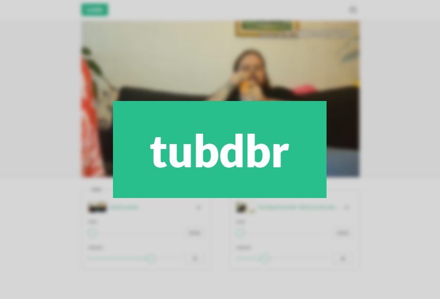

# tubdbr

A YouTube video remixer.

Libraries and tools used include:

* [webpack](https://webpack.github.io/)
* [Babel](https://babeljs.io/)
* [Vue.js](https://vuejs.org/)
* [Vuex](http://vuex.vuejs.org/)
* [Bootstrap for Sass](https://github.com/twbs/bootstrap-sass)
* [Plyr](https://github.com/Selz/plyr)
* [ESLint](http://eslint.org/)
* and many more

## Running tubdbr

Install dependencies:

    npm install

To run development server with hot reload:

    npm run dev

To build production bundle:

    npm run build
